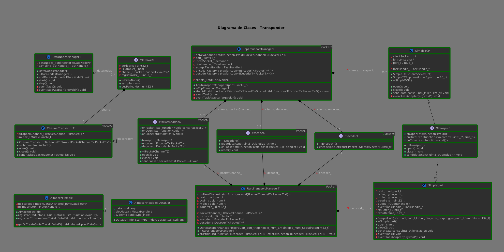

# FlightProxy: Cross-Platform Communication Middleware

## 🚧 Project Status: Infrastructure Complete / Logic In-Progress

**Current State:** The **Core Infrastructure**, **HAL (Hardware Abstraction Layer)**, and **Communication Middleware** are fully implemented and operational. The Application Logic (Business Layer) is currently under active development.

This repository demonstrates a production-grade architecture designed to decouple the business logic from the underlying hardware and operating system.

---

## 🎯 Architectural Highlights

The system is built on a **"Write Once, Run Anywhere"** philosophy, allowing the same core C++ code to run on an **ESP32 (FreeRTOS)** for deployment and on **Windows** for simulation and testing.

### 1. Hardware Abstraction Layer (HAL) & OSAL
To achieve true cross-platform compatibility without `#ifdef` spaghetti code in the business logic, I implemented a strict **OSAL (Operating System Abstraction Layer)** using the **Abstract Factory Pattern**:

* **OS Agnostic:** The core logic requests resources (Mutexes, Queues, Tasks) via an `OSALFactory`.
* **Implementations:**
    * **PlatformESP32:** Maps calls to FreeRTOS primitives.
    * **PlatformWin:** Maps calls to Windows API / STL threads.
* **Zero Rewrites:** The application layer remains 100% identical regardless of the target platform.

### 2. Advanced Communication Middleware ("Channel" Architecture)
Communication is abstracted into a flexible **Channel** system that handles data flow reliably:

* **Transport Agnostic:** Supports **TCP**, **UDP**, and **UART**. The logic uses `IChannel` interfaces and doesn't care about the physical medium.
* **Self-Healing Connections:** Implemented `ChannelPersistentT`, a wrapper that automatically detects connection drops and manages background reconnection tasks without blocking the main application.
* **Virtual Channels:** Includes a multiplexer (`ChannelDisgregatorT`) to route multiple logical command streams over a single physical link.

### 3. Modern C++ Practices
* **Memory Safety:** Extensive use of Smart Pointers (`std::shared_ptr`, `std::weak_ptr`) to manage lifecycles and prevent memory leaks.
* **Thread Safety:** Granular locking mechanisms and thread-safe queues ensuring robust concurrency.
* **Templates:** Heavily templated architecture to allow swapping Packet types and Protocols easily.

---

## UML Diagram

Temporary diagram illustrating the transport layer architecture:

## 📂 Project Structure Overview

* `Core/` ➡️ **Interfaces & Abstractions:** Defines the `ITransport`, `IChannel`, and `OSALFactory` contracts.
* `Channel/` ➡️ **Middleware Implementation:** Contains the routing logic, persistence managers, and aggregator/disgregators.
* `PlatformESP32/` ➡️ **ESP32 Implementation:** Concrete implementations for FreeRTOS and LwIP (TCP/UDP).
* `PlatformWin/` ➡️ **Windows Implementation:** Concrete implementations for WinSock and STL threading.
* `AppLogic/` ➡️ **Business Logic:** (In Progress) The high-level control loops and state machines.

---

## 🛠️ Tech Stack
* **Language:** C++17
* **Build System:** PlatformIO
* **Target Hardware:** Espressif ESP32
* **Simulation Environment:** Windows x64
* **Protocols:** TCP/IP, UDP, Custom Serial Protocols.